# Homework 2: Design Specification

This document is last edited by Team _Undefined_ on April 18, 2019.

## Problem

Pentland et al. stressed the importance of relationships and how it is essential to a team’s success. Their research has shown that interpersonal conversations and social interactions have improved engagement, employee experience, and productivity. However, not every team communicates efficiently nor has strong relationships with one another. The problem we will be focusing on is communication and building trust between teams and team members.

Jong et al. states in their article that negative relationships within the team influences team performance. Research has shown that interpersonal relations marked with animosity can reduce team cohesion and induce team conflicts. Moreover, Jong et al. mention team members who experience negative emotions can influence and produce a native climate. This, in turn, can obstruct communication within the team. For instance, Jong et al. states in this type of environment team members can withhold information or sabotage another colleague.  In contrast, positive interactions have shown to promote a positive and more welcoming environment. The authors state that effective communications within the teams can soften negative experiences experienced by some team members. Similarly, positive interactions can offset negative relationships within teams.

No matter the project the team is working on, whether that be a technical project or theoretical project, team conflict is unavoidable. There is an existing app called “IceBreaker: Have Better Dates” that provides questions for couples on a first date. The problem with this app is that there is no category of questions to pick from, no option to pick what question comes up and no flexibility to edit or add a question. If a user wants to talk about a topic they are comfortable with but random questions they do not want to answer repeatedly appear, it may lead to frustration and cause tension between the pair.

Additionally, “Polleverywhere” does introduce the ability to present flexible questions. However, the overall design of the application is too complicated for both the participant and poll creator. Moreover, from the participants perspective, there isn’t a motivating factor that promotes interpersonal communication. This, in turn, does not foster relationships between teammates and would not be particularly effective in utilizing for the purpose of building or strengthening relationships.

Another existing application that also provides a fun break from work is “Kahoot!” Kahoot! is a program, in which a teacher in a classroom setting can create questions for the students to answer. There is an option for Kahoot! to participate as teams, and this provides an opportunity for team bonding. However, this program does not give students the opportunity to get to know one another, and bond over shared interests as the program was designed to be a review of students’ knowledge in class.

A new solution is needed in order to address the difficulties team members experience when working on a team project. There is a large gap within current solutions being implemented in terms of its ability to allow members to get to know each other and integrating face-to-face talking opportunities. This gap makes it difficult for team members to move past the stage of being “in the same group” to “acquaintances or friends”, and fostering a close and positive relationship is integral to the success of the team. Therefore, the solution outlined below revolves around getting team members to know each other and an opportunity to move the relationship past the initial uncomfortableness.  

## Solution

### Figure 1

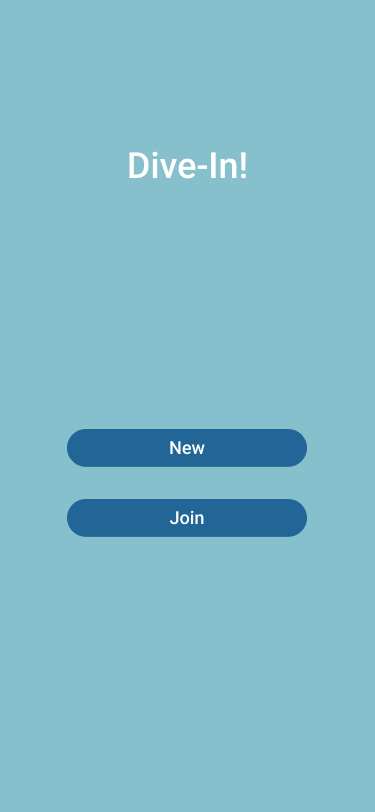

[Figure 1](img/figure1.png) shows the main page of our web application, Dive-In!. It provides the user with two abilities:

- New which creates a new room
- Join an existing room

The “New” feature will provide Organizers the ability to create a new room while “Join” will connect players with a currently open room.

### Figure 2

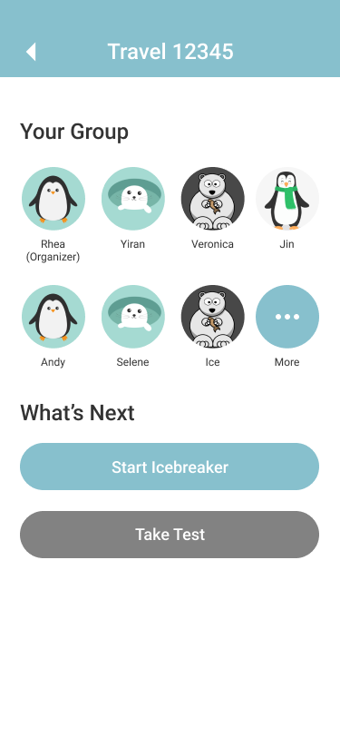

[Figure 2](#figure-2) is when the Organizer has created a room upon clicking the “New” button in [Figure 1](#figure-1). It provides the ability to begin the ice breaker game after an ample amount of people are participating. They will have two different options which are:

- Begins the icebreaker game
- A knowledge test where all the players are given a series of question on how well they know each other.

The “Start Icebreaker” button will be disabled if there are less than 2 people in the room. The game will not begin unless there are at least two people in the room.

### Figure 3

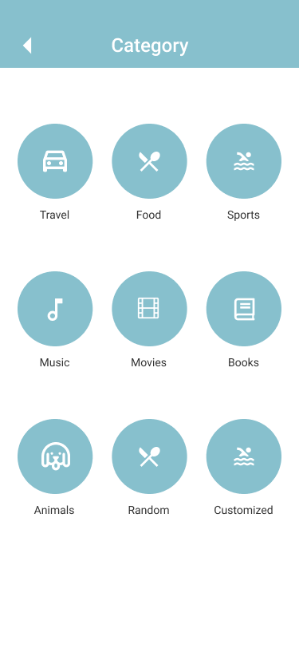

When the Organizer presses on the “Start Icebreaker” they will be lead to the screen shown in [Figure 3](#figure-3). The Organizer would select a **category** of questions they would like to go through. Each icon represents a specific genre of questions. The random option will randomly select questions from each category. While the customized option allows the organizer of the room to write their own questions.

### Figure 4

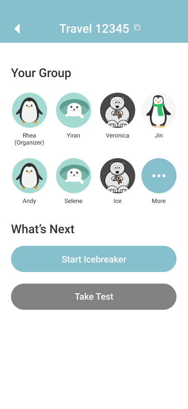

After the Organizer has selected at least one category, the “next” button will turns from gray to blue which allows the organizer to change the selections. After clicking the “next” button, the organizer will be lead to the screen shown in [Figure 4](#figure-4) where allows the Organizer to choose from the following options:
- Clicking “Start the game” when there are at least 2 participants (including the organizer) in the room.
- View who has joined the room.
- Copy room ID
- Share room ID in other Apps
- Go back to change selections

_TODO_

### Figure 5

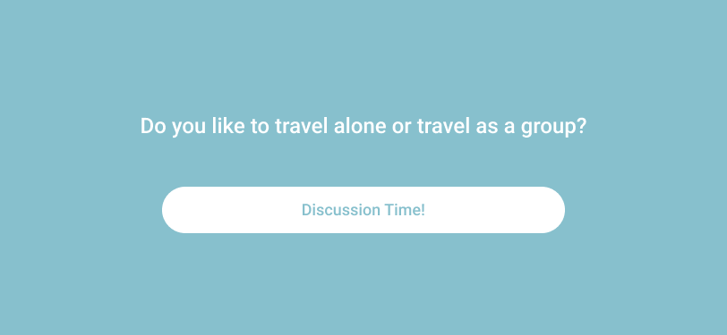

The Organizer will be lead to the [Figure 5](#figure-5) after clicking “Start the game”. The “Discussion Time!” button will automatically show the next display in [Figure 6](#figure-6). Similarly, it will display the question on the Organizer’s screen to every player in the room.

### Figure 6

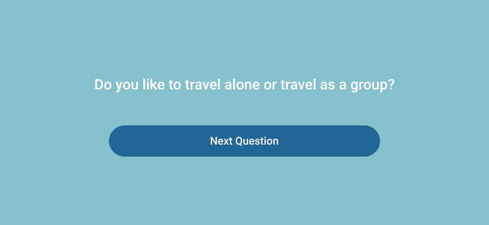

[Figure 6](#figure-6) will provide the Organizer with the option to move forward to the next question which will display the next question on the Organizer’s display like [Figure 5](#figure-5).

### Figure 7

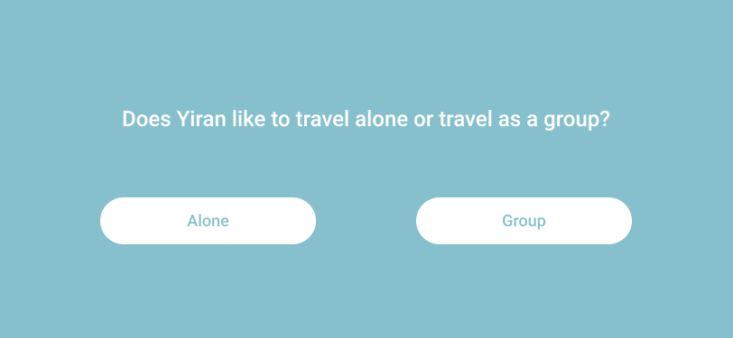

[Figure 7](#figure-7) would appear after the Organizer selects the “Take Test” button. This feature will test every player’s knowledge of how familiar they are with their team members. The player will be awarded points based on whether they answer correctly or incorrectly.

### Figure 8

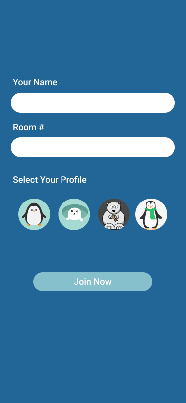

If the player selects the “Join Now” button in [Figure 1](#figure-1), they will be led to [Figure 8](#figure-8). The player will input their name and room number into the corresponding text boxes and select an icon. The “Join Now” button connects the user to the corresponding room number. Once the button is selected, it will check that the room number is correct and try to connect. However, if the player inputs an incorrect room number then, an error message will appear and ask the user to type in the correct information.

### Figure 9

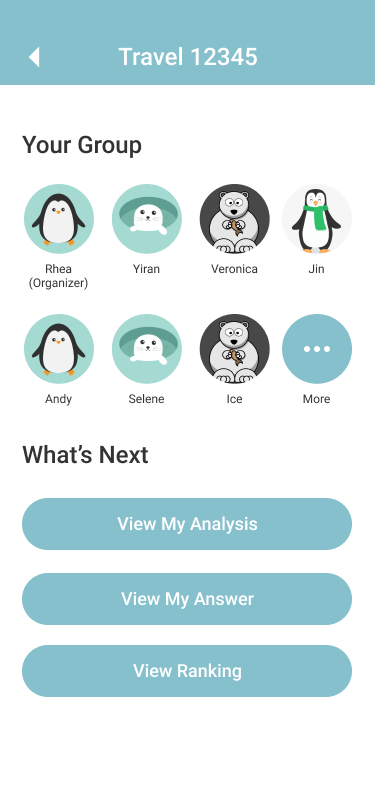

Similarly, after the icebreaker is completed, the players will be shown in [Figure 9](#figure-9). Players will have three different features:

- An analysis where a personal report is generated showing how well the player did.
- The player can overview their answers to the questions they answered.
- They can see their rank in comparison to their teammates.

The “View Ranking” feature will only appear after the test has been done.

### Figure 10

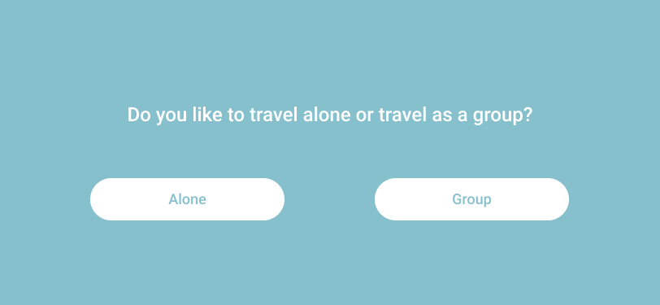

After the Organizer selects a category and initiates “Discussion Time!” as shown in [Figure 5](#figure-5), each player will be lead to the screen shown in [Figure 10](#figure-10). [Figure 10](#figure-10) displays the same question on every player’s displays. Likewise, they will have two options to choose from.

### Figure 11

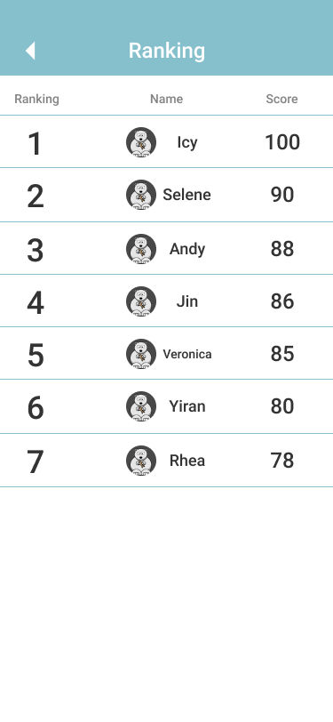

[Figure 11](#figure-11) is presented after the player selects “View Ranking” from [Figure 9](#figure-9). It would show the player the rankings of all the players within the same room which is calculated from their test scores.

### Figure 12

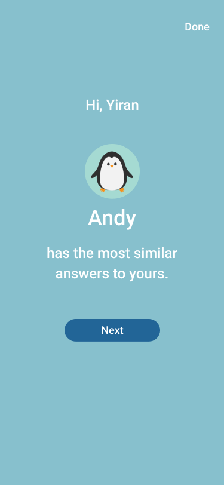

[Figure 12](#figure-12) would be shown to the player after they press on the “View My Analysis” feature from [Figure 9](#figure-9). The player will be shown who they are most compatible with based on their answers. They will be provided two options:

- Clicking the “Next” button will display [Figure 13](#figure-13).
- Clicking the “Done” button will exit the analysis screen and display [Figure 9](#figure-9).

### Figure 13

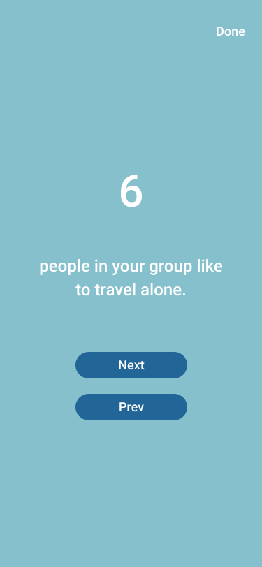

[Figure 13](#figure-13) displays how many people enjoy similar activities as the player or has similar commonalities as them. The player is provided three options:

- Clicking “Next” will show another screen similar to [Figure 13](#figure-13) with analysis for a different question
- Clicking “Prev” will lead back to the previous analysis page
- Clicking “Done” will exit the analysis feature

## References

1. Jong, Jeroen P. De, et al. “When Do Bad Apples Not Spoil the Barrel? Negative Relationships in
Teams, Team Performance, and Buffering Mechanisms.” Journal of Applied Psychology,
vol. 99, no. 3, 2014, pp. 514–522., doi:10.1037/a0036284.
2. Pentland, Alex "Sandy", et al. “The New Science of Building Great Teams.”Harvard Business Review,
15 July 2015, hbr.org/2012/04/the-new-science-of-building-great-teams.
3. Windsor, Grace. “How to Tackle Poor Project Communication.” BrightWork.com, 24 May 2018,
www.brightwork.com/blog/tackle-poor-project-communication.
4. [IceBreaker: Have Better Dates](https://itunes.apple.com/us/app/icebreaker-have-better-dates/id1304625074?mt=8)
5. [PollEverywhere](https://polleverywhere.com)
6. [Kahoot](https://kahoot.com/)
7. Our high-fidelity prototype is located [here](https://www.figma.com/file/gW7445WDsd8zFo0SUEv2Nyzi/Prototype?node-id=0%3A1)
